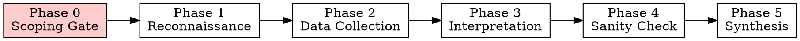

# DeFi On-Chain Analytics

> **Core Principle:** 「先固定資料可信度與上下文，再做最小足夠的讀取，之後才做歸因與敘事。」
> First fix data confidence and context, then do minimum sufficient reads, then do attribution and narrative.

Every analysis session serves this hierarchy: **confidence > efficiency > interpretation**.

## Two-Layer Architecture

Every step is tagged with its required tier:

| Tier | Tag | Requires | Free public RPC? |
|------|-----|----------|-----------------|
| A | `[CORE]` | Standard JSON-RPC | Yes |
| B | `[ARCHIVE]` | Historical state >128 blocks | Rarely |
| C | `[TRACE]` | debug/trace namespace (Geth archive or Erigon) | No |
| D | `[ENRICH]` | External source (Etherscan API, Sourcify, 4byte) | Yes but not RPC |

**Default = Tier A only.** Higher tiers are opt-in. If unavailable, disclose the gap — never silently skip.

## The 6-Phase Workflow



**No phase may be skipped. No RPC calls before Phase 0 is complete.**

---

### Phase 0: Scoping Gate — Active Consultation

> **This phase is a guided conversation, NOT a passive form.**
> Read `references/scoping-guide.md` for detailed consultation techniques, depth/angle options, field-by-field asking guidance, and anti-patterns.
> **NEVER silently assume — always surface your assumptions as explicit questions.**

#### Analysis Modes

| Trigger | Mode | Emphasis |
|---------|------|----------|
| Suspicious activity / incident | 🔍 Forensic | Fund flows, timeline, counterparties |
| Investment / trading decision | 📊 Due Diligence | Risk, PnL, position health |
| Portfolio / position monitoring | 📈 Monitoring | Current state, health indicators |
| Protocol evaluation / comparison | 🏗️ Protocol Assessment | TVL, risk params, governance |
| Security review / audit prep | 🛡️ Security | Admin keys, upgrades, custody |
| General curiosity / learning | 🔭 Exploratory | Broad survey, teach as you go |

#### Required Fields

| # | Field | Required? | Default |
|---|-------|-----------|---------|
| 1 | **Target** | Yes | — |
| 2 | **Chain** | Yes | — |
| 3 | **Objective** | Yes | — |
| 4 | **Hypothesis** | No | "Exploratory" |
| 5 | **Timeframe** | No | Per depth choice |
| 6 | **Expected output** | No | "Structured findings + narrative" |
| 7 | **Data source policy** | No | raw RPC only |
| 8 | **Anchor policy** | No | `safe` if supported |
| 9 | **Capability tier** | Auto | Probe-based |
| 10 | **RPC endpoint** | Auto | From `references/rpc-endpoints.ts` |

#### Anchor Policy Options

| Policy | `fromBlock` | `toBlock` | Use Case |
|--------|------------|----------|----------|
| `safe` | — | `safe` tag | **Default.** Finalized, no reorg risk. |
| `pinned` | specific hex | specific hex | Reproducible snapshot at known block. |
| `latest` | — | `latest` tag | Real-time data, accepts reorg risk. |
| `historical-scan` | `0` or contract creation block | `safe` | **Full-chain event scanning.** Each event gets its own timestamp via `eth_getBlockByNumber`. Reproducibility footer must list the full scan range and the completion block. Use adaptive chunking (see `references/rpc-field-guide.md` Section 5). |

#### Blind Spot Disclosure

Before confirming, proactively flag what the analysis CANNOT see. See `references/scoping-guide.md` for templates.

#### Confirmation Gate

**Always present a structured summary before proceeding. NEVER skip this.**

```
═══ ANALYSIS PLAN ═══
🎯 Target: [address/protocol/token]
🔗 Chain: [chain]
📋 Objective: [clear restatement]
🔬 Approach: [depth] + [angle]
🧪 Hypothesis: [if any, or "Exploratory"]
⏱️ Timeframe: [window]
📊 Output: [format]
⚡ Data policy: [Tier A / A+D / etc.]
⚓ Anchor: [safe / pinned / latest / historical-scan]
⚠️ Blind spots: [key limitations]

Estimated effort: ~[N] RPC calls
═════════════════════
```

```
═══ ANALYTICAL CONTRACT ═══
⚙ Tier A baseline: [list the RPC calls that MUST be made before any Tier D source is used]
📜 Script trigger: [YES if any dependent flow / eth_getLogs scan / multi-hop trace is needed]
🔍 Root cause standard: Any causal claim sourced from Tier D only → tagged [UNVERIFIED] until Tier A/B corroboration
🧪 Claim typing: All major findings typed as FACT_ONCHAIN / INFERENCE_ONCHAIN / EXTERNAL_ASSERTION before Phase 4
═══════════════════════════
```

**Gate rules:**
- User must confirm BOTH the Analysis Plan AND the Analytical Contract before Phase 1 begins.
- If user says "just do it" → present the plan, then proceed.
- Auto-probe capability tier (Field 9) via test calls. Timeout/failure = assume Tier A.
- Auto-select RPC endpoint (Field 10): read `references/rpc-endpoints.ts` → pick top Tier S/1 → probe with `eth_chainId` → fallback on failure. For BSC, MUST use endpoint with `getLogs: true` (Tier 1/2 only).
- **Cross-chain check:** If target involves bridges or multi-chain activity, flag and expand scope.
- Load relevant pattern file(s) based on objective (see Pattern Loading below).

---

### Phase 1: Reconnaissance

**RPC-first. External metadata is enrichment, not baseline.**

Read `references/abi-fetching.md` for proxy detection. Read `references/rpc-field-guide.md` for method reference.

**Step 1 — Contract Classification `[CORE]`:**
1. `eth_getCode(address)` — EOA (empty) or contract?
2. If contract: `eth_getStorageAt` for EIP-1967 slots (implementation, beacon, admin)
3. Bytecode pattern match for EIP-1167 minimal clone
4. If proxy detected → read implementation → repeat on implementation

**Step 2 — Proxy Pattern Identification `[CORE]`:**

| Pattern | Detection |
|---------|-----------|
| Transparent / UUPS | EIP-1967 implementation slot non-zero |
| Beacon | EIP-1967 beacon slot → `eth_call` beacon's `implementation()` |
| EIP-1167 Minimal Clone | Bytecode prefix `363d3d373d3d3d363d73` |
| Diamond (EIP-2535) | Loupe functions + `DiamondCut` events |
| Non-standard | `[TRACE]` — trace delegatecall targets |

**Step 3 — Address Context `[CORE]`:**
- `eth_getBalance`, `eth_getTransactionCount`, `eth_getStorageAt` for owner/admin slots
- Lineage (deployer, creation tx): `[ENRICH]` — mark `N/A` in strict RPC mode

**Step 4 — Source Bootstrap `[ENRICH]` (opt-in):**
- Etherscan `getsourcecode`, Sourcify, 4byte.directory
- Entity labels → heuristic, confidence auto-downgraded

**Tier D Precondition:** Before using any Tier D source for a given finding, the equivalent Tier A query MUST already exist in the evidence register. Tier D enriches; it never substitutes. If Tier A is unavailable, disclose the gap — do not fill it with Tier D.

**Output: Reconnaissance summary table.** Every field tagged with source tier. Unavailable fields marked `N/A (requires Tier X)`.

```
=== RECONNAISSANCE SUMMARY ===
Target: 0x...
Chain: Ethereum
Type: Contract (Proxy: UUPS → Implementation: 0x...)
Native Balance: 1.5 ETH [CORE]
Nonce: 4,231 [CORE]
Owner: 0x... (EOA) [CORE]
Deployer: N/A (requires Tier D)
Capability tier: A (standard RPC)
Anchor: block 19,500,000 (safe)
```

---

### Phase 2: Data Collection

**Rule: Block-anchor everything. Probe before assuming. Disclose gaps.**

Read `references/rpc-field-guide.md` for method details. Read `references/common-abis.md` for event signatures.

**Tier 1 — Batch Reads `[CORE]`:**
- Multicall3 or JSON-RPC batch, pinned to single block number
- Use for: balances, vault positions, pool reserves, oracle prices

**Tier 2 — Event Logs `[CORE]`:**
- Never unbounded block range
- Adaptive chunking: probe provider limit, bisect on cap, paginate
- Filter: `address + topics[0]` when possible; adapt for anonymous/factory scans

**Tier 3 — Traces `[TRACE]` (opportunistic):**
- `callTracer(withLog:true)` — internal calls + logs per frame
- `prestateTracer(diffMode:true)` — pre/post state diff
- `trace_filter` (Erigon) — address-range internal tx search
- **Iron rule:** If native ETH flow + Tier C available → traces mandatory. If unavailable → disclose: _"Native ETH internal transfers not captured. Fund flow covers ERC20 only."_

**Tier 4 — State Override `[TRACE]`:**
- `eth_call` with `stateOverride` / `blockOverride` for hypothesis testing
- Use `stateDiff` (merge) not `state` (wipe) unless intended

**Tier 5 — Specialized (probe first):**
- `eth_getProof` `[CORE]`, `eth_getBlockReceipts` `[varies]`, `eth_createAccessList` `[CORE]`

**Script generation decision:**

| Condition | Mode |
|-----------|------|
| Independent trivial reads (balance, nonce, single slot) | Inline `curl` |
| Any dependent / sequential calls | Generate JS/TS (viem or ethers.js) |
| Any `eth_getLogs` scan (any range) | Generate script |
| Multicall3 batch | Generate script |
| Multi-hop fund flow tracing | Generate script |

Scripts must be self-contained and runnable via `node` or `npx tsx`.

**Execution discipline:**
- Log purpose before every query
- Decode all hex inline — never leave raw hex
- Use fallback endpoints on failure
- Disclose when methods are skipped due to tier

---

### Phase 3: Interpretation

Read the relevant domain pattern file for analytical methods. Apply the Investigation Discipline protocol throughout this phase (see below and `references/investigation-discipline.md`).

**Classification-first.** Tag every finding before narrative:

| Category | Source | Confidence | Min Tier |
|----------|--------|-----------|----------|
| **State-based** | Storage, balances, rates | Highest | A |
| **Flow-based (events)** | Transfer/Swap events | High | A |
| **Flow-based (traces)** | Internal calls, native ETH | High | C |
| **Label-based** | Entity attribution | Medium (degrades) | D |
| **Inferred** | Patterns, correlation | Lowest | varies |

**Time-alignment:** `block number → tx index → log index → traceAddress`

**Mental models (in order):**
1. **Attribution hierarchy** — state > flow > label > inference
2. **Follow the money** — traces if Tier C; events if Tier A (disclose native ETH gap)
3. **Behavioral pattern matching** — against domain reference patterns
4. **MEV noise awareness** — same-block buy+sell, tx index adjacency, known builders → flag
5. **Entity clustering** — shared funding, synchronized timing → "wallet" upgrades to "entity"
6. **Anomaly flagging** — rolling baseline if available; rule-based flags if no stable baseline

**Tokenomics mandatory check:**

| Property | Impact | Detection |
|----------|--------|-----------|
| Rebasing | Balance changes without Transfer events | balanceOf delta without Transfer |
| Fee-on-transfer | Sent ≠ received | Transfer amount vs balanceOf delta |
| ERC-4626 shares | Share ≠ underlying | Read `convertToAssets()` |
| Wrapped staking | Conversion rate drifts | Read wrapper rate function |

---

### Phase 4: Sanity Check

**Always-on checks:**
- [ ] All reads anchored to same block / finality level?
- [ ] Internal txs accounted for (traces if ETH flow + Tier C)?
- [ ] Gaps disclosed if traces unavailable?
- [ ] Proxy vs implementation resolved?
- [ ] Labels cross-referenced, not blindly trusted?
- [ ] Off-chain blind spots acknowledged? (CEX internal, L2, OTC)
- [ ] Every finding tagged with tier dependency?
- [ ] **Blind Spot Audit completed?** (Layer 4 — see `references/investigation-discipline.md`)
- [ ] **Gap Log produced?** (Layer 7 — every skipped method/source logged with reason and impact)
- [ ] **Confidence-triggered deepening applied?** (Layer 5 — no Medium-confidence significant findings left unaddressed)

**Domain-specific pitfall packs** — load based on Phase 0 objective. Full checklists in each pattern file.

---

### Phase 5: Synthesis

**7 mandatory output sections:**

1. **Structured findings** — tables, human-readable values ($1.5M, 1,500 ETH), block references
2. **Narrative** — answers Phase 0 objective, addresses hypothesis
3. **Confidence matrix** — per finding: category, confidence, tier, cross-validated?
4. **Visualization** — Mermaid.js flow diagrams for fund flows
5. **Open questions** — what needs further investigation
6. **Reproducibility footer:**
```
Chain / Anchor block / Anchor policy / RPC provider
Capability tier / Trace-enabled / Archive / External sources
Total RPC calls / Analysis timestamp
```
7. **Evidence register** — per finding: RPC method, params, block ref, cross-validation

---

## Pattern File Loading

| Objective keywords | Load |
|-------------------|------|
| wallet, address, PnL, whale, smart money, entity | `patterns/wallet-analytics.md` |
| TVL, protocol, risk, yield, pool, vault, lending | `patterns/protocol-analytics.md` |
| token, holder, distribution, supply, vesting | `patterns/token-analytics.md` |
| DEX, swap, liquidity, LP, impermanent loss, volume | `patterns/dex-analytics.md` |
| contract, storage, events, proxy, upgrade, ABI | `patterns/contract-inspection.md` |

Multiple files may load if objective spans domains. Reference files (`references/`) loaded on-demand during Phase 1-2.

### Cascade Triggers

During Phase 2-3, load additional patterns when the investigation reveals new dimensions:

| Trigger (during analysis) | Load |
|--------------------------|------|
| Entities or wallets identified that need profiling or clustering | `patterns/wallet-analytics.md` |
| Unknown contract encountered requiring ABI resolution or storage inspection | `patterns/contract-inspection.md` |
| Token supply, holder distribution, or vesting analysis needed | `patterns/token-analytics.md` |
| Protocol-level risk, TVL, or oracle dependency assessment triggered | `patterns/protocol-analytics.md` |
| DEX swap, liquidity, or position analysis required | `patterns/dex-analytics.md` |

### Composed Investigation Recipes

Common multi-pattern investigations and their recommended pattern combinations:

| Investigation Type | Primary | Companions | Key Flow |
|-------------------|---------|------------|----------|
| **Market Structure** — who provides liquidity, how distributed, why | dex-analytics | wallet-analytics, contract-inspection | Position enumeration → owner resolution → entity clustering → funding trace |
| **Whale Tracking** — identify, profile, predict behavior | wallet-analytics | token-analytics, dex-analytics | Balance snapshot → transfer history → behavioral fingerprinting → DEX activity |
| **Protocol Risk** — TVL health, admin risk, oracle dependency | protocol-analytics | contract-inspection | TVL decomposition → proxy/admin inspection → oracle staleness check |
| **Incident Forensics** — exploit trace, fund flow, counterparty ID | wallet-analytics | contract-inspection, dex-analytics | Pre-attack screen (TVL trajectory, 72h suspicious activity, capital flow) → Fund flow trace → contract inspection → DEX swap analysis → entity clustering |
| **Token Due Diligence** — supply integrity, holder risk, vesting pressure | token-analytics | wallet-analytics, contract-inspection | Supply audit → holder concentration → whale behavior → vesting schedule |

## Investigation Discipline — 7-Layer Defense

Read `references/investigation-discipline.md` for full methodology, DeFi-specific anti-rationalization phrases, iterative depth protocol, and adversarial self-review questions.

| # | Layer | Rule | Active |
|---|-------|------|--------|
| 1 | **Anti-Rationalization** | Dismissal instincts are investigation signals. Wanting to say "probably normal" → investigate that exact thing deeper. | Always |
| 2 | **Iterative Depth** | Phase 3 runs multiple passes. Pass 2 (Forensic/Deep History): adversarial re-examination — "if this were malicious, what would the evidence look like?" | 🔍🔴 |
| 3 | **Anti-Normalization** | "Looks normal" is evidence of sophistication, not innocence. Adversarial actors design on-chain footprints to appear normal. "Too clean" = red flag. | Always |
| 4 | **Blind Spot Audit** | Phase 4 must list what was NOT investigated and what each gap could hide. Empty blind spot audit = failed Phase 4. | Always |
| 5 | **Confidence Deepening** | Confidence < High + significance ≥ Medium → additional query, cross-validation, OR explicit UNRESOLVED. No "Medium confidence, probably fine." | Always |
| 6 | **Adversarial Self-Review** | Per major finding: "What is the opposite interpretation?" + "What adjacent pattern does this obscure?" + "What would falsify this?" + "Does any other finding enable this?" | Always (documented in 🔍) |
| 7 | **Gap Logging** | Every skipped method/source logged with reason and potential impact. Silent omission = discipline violation. | Always |

### Banned Dismissal Phrases

If these appear in your reasoning → treat as investigation signal, not conclusion:

> "probably just a whale" · "likely normal behavior" · "this is expected for a DEX pool" · "no suspicious activity found" · "the amounts are not unusual" · "this is just MEV" · "the timing is coincidental"

### Common Rationalizations

| Rationalization | Reality |
|----------------|---------|
| "Let me just quickly check the balance" | Complete Phase 0 first. Even a balance check needs chain + anchor. |
| "I don't need to probe the provider" | Provider capabilities vary wildly. Probe once, save time later. |
| "This is just a simple token lookup" | Simple lookups still need the scoping form. Discipline prevents drift. |
| "I'll decode the hex later" | Decode inline. Raw hex in output = failed analysis. |
| "The block range is probably fine" | Never guess. Adaptive chunk or risk timeout/truncation. |
| "Traces aren't available so I'll skip fund flow" | Disclose the gap. Don't silently omit native ETH flows. |

## Red Flags — STOP

- Making RPC calls before completing Phase 0
- Using `"latest"` without explicitly choosing it in anchor policy
- Leaving raw hex values in output
- Querying `eth_getLogs` without bounded block range
- Not disclosing when a method is skipped due to tier
- Mixing data from different blocks without anchoring
- Trusting entity labels without cross-referencing raw data
- Using Tier D source (Etherscan, labels, reports) before the equivalent Tier A query exists in the evidence register
- Accepting an EXTERNAL_ASSERTION as root cause without Tier A/B corroboration
- **Dismissing a finding without first asking "What would make this significant?"**
- **Reporting a conclusion without disclosing what analysis was NOT performed**
