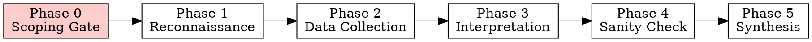

# DeFi On-Chain Analytics

> **Core Principle:** 「先固定資料可信度與上下文，再做最小足夠的讀取，之後才做歸因與敘事。」
> First fix data confidence and context, then do minimum sufficient reads, then do attribution and narrative.

Every analysis session serves this hierarchy: **confidence > efficiency > interpretation**.

## Two-Layer Architecture

Every step is tagged with its required tier:

| Tier | Tag | Requires | Free public RPC? |
|------|-----|----------|-----------------|
| A | `[CORE]` | Standard JSON-RPC | Yes |
| B | `[ARCHIVE]` | Historical state >128 blocks | Rarely |
| C | `[TRACE]` | debug/trace namespace (Geth archive or Erigon) | No |
| D | `[ENRICH]` | External source (Etherscan API, Sourcify, 4byte) | Yes but not RPC |

**Default = Tier A only.** Higher tiers are opt-in. If unavailable, disclose the gap — never silently skip.

## The 6-Phase Workflow



**No phase may be skipped. No RPC calls before Phase 0 is complete.**

---

### Phase 0: Scoping Gate — Active Consultation

> **This phase is a guided conversation, NOT a passive form.**
> Proactively ask questions, offer analysis approaches with trade-offs, and confirm understanding before proceeding.
> **NEVER silently assume — always surface your assumptions as explicit questions.**

#### Step 0.1: Intent Discovery

Before collecting any fields, understand **why** the user wants this analysis. Use structured questions with options to guide them efficiently.

**Always ask — even if the user gives an address and says "check this":**

1. **What triggered this analysis?** _(determines analysis mode)_

   | Trigger | Mode | What it emphasizes |
   |---------|------|--------------------|
   | Suspicious activity / incident | 🔍 Forensic | Trace fund flows, timeline reconstruction, counterparty identification |
   | Investment / trading decision | 📊 Due Diligence | Risk metrics, PnL, position health, token economics |
   | Portfolio / position monitoring | 📈 Monitoring | Current state, health indicators, threshold alerts |
   | Protocol evaluation / comparison | 🏗️ Protocol Assessment | TVL composition, risk parameters, governance, upgrade history |
   | Security review / audit prep | 🛡️ Security | Admin keys, upgrade patterns, privileged functions, fund custody |
   | General curiosity / learning | 🔭 Exploratory | Broad survey, explain what's interesting, teach as you go |

   > Present these as options. If the user's request maps clearly to one mode, **propose it and ask for confirmation** rather than asking from scratch.

2. **What decision will the results inform?** _(determines depth and output format)_
   - Helps calibrate between "quick sanity check" vs "court-grade evidence trail"
   - If user says "just curious" → still ask: "Curious about what specifically? I can focus on [2-3 relevant angles based on the target]."

3. **What do you already know?** _(avoids redundant work, catches misconceptions early)_
   - "Is this address a protocol, a wallet, a token contract, or you're not sure?"
   - "Have you interacted with this before, or is it completely new to you?"
   - If user has a hypothesis → capture it; you'll test it explicitly in Phase 3.

#### Step 0.2: Approach Negotiation — Present Options with Trade-offs

Based on the intent, **proactively present 2-3 analysis approaches** with clear pros/cons. Don't ask the user to design the approach — propose and let them choose.

**Depth Options:**

| Option | What you get | Cost | Best for |
|--------|-------------|------|----------|
| 🟢 **Snapshot** — Current state only | Balance, positions, rates, health factors at one block | ~5-15 RPC calls, <1 min | Quick health check, "what does this address hold right now?" |
| 🟡 **Window** — Recent period (7d/30d/custom) | Behavioral patterns, trends, recent PnL | ~50-300 calls, needs log scanning | "What has this address been doing recently?" |
| 🔴 **Deep History** — Full lifecycle | Complete transaction history, total PnL, all counterparties | Hundreds-thousands of calls, may need archive node (Tier B) | Forensic investigation, full entity profiling |

**Angle Options (present the 2-3 most relevant based on target type):**

| Angle | Approach | Pros | Cons |
|-------|----------|------|------|
| **Top-down** | Protocol → pools → top addresses | Systematic, complete coverage | Misses cross-protocol activity |
| **Bottom-up** | Address → transactions → counterparties → protocols | Follows the money, catches hidden connections | Can spiral without bounds |
| **Comparative** | Side-by-side vs benchmark (similar protocols, top wallets) | Context-rich, relative assessment | Doubles the data collection work |
| **Hypothesis-driven** | Test a specific claim with targeted data | Efficient, focused | May miss unexpected findings |

> **Always recommend** one approach based on the user's stated intent. Explain why. Ask if they agree or want to adjust.

#### Step 0.3: Field Collection — Conversational, Not Form

Collect through natural dialogue. For **every** field the user doesn't specify, state your default assumption and ask for confirmation.

| # | Field | Required? | Default | How to ask |
|---|-------|-----------|---------|------------|
| 1 | **Target** | Yes | — | If ambiguous: "I see an address — is this the main target, or should I also look at related contracts (e.g., the protocol's router, vault, or governance)?" |
| 2 | **Chain** | Yes | — | Infer from address context if possible. If unclear: "Which chain? Ethereum / Arbitrum / Base / BSC / Polygon / Katana — or multiple?" |
| 3 | **Objective** | Yes | — | Derived from Step 0.1. Restate in your own words: "So your main question is: [restatement]. Is that right?" |
| 4 | **Hypothesis** | No | "Exploratory" | "Do you have a specific theory to test? (e.g., 'this wallet is connected to X', 'this protocol is under-collateralized') Or should I explore with fresh eyes?" |
| 5 | **Timeframe** | No | Per Step 0.2 depth choice | "Based on [chosen depth], I'll look at [timeframe]. Want to adjust?" |
| 6 | **Expected output** | No | "Structured findings + narrative" | "How should I deliver results? Options: **(a)** Quick summary with key metrics — good for a fast read. **(b)** Full report with evidence trail — good for sharing or deeper review. **(c)** Raw data tables — good if you'll do your own analysis." |
| 7 | **Data source policy** | No | **raw RPC only** | "I'll use **raw RPC only** (highest confidence, zero trust assumptions). Want me to also pull from Etherscan/Sourcify for labels and source code? Adds context but introduces external trust." |
| 8 | **Anchor policy** | No | `safe` if supported | Only explain if the user is technical or the choice matters: "`safe` = finalized, no reorg risk. `latest` = freshest but could reorg. I'll default to `safe`." |
| 9 | **Capability tier** | Auto | Probe-based | Auto-probe silently, report result. |
| 10 | **RPC endpoint** | Auto | From `references/rpc-endpoints.ts` | Auto-select, report choice. |

#### Step 0.4: Blind Spot Disclosure

**Before confirming, proactively flag what the analysis CANNOT see:**

- "⚠️ On-chain analysis can't see: CEX internal transfers, OTC deals, off-chain agreements, L2 activity (unless we scope those chains too)."
- If Tier A only: "Without archive/trace access, I won't capture native ETH internal transfers or historical state. I'll flag where this matters."
- If no enrichment: "Without Etherscan labels, addresses will be raw hex — I'll note patterns but can't name entities."

> This prevents users from over-trusting results and sets expectations early.

#### Step 0.5: Confirmation Gate

**Always present a structured summary before proceeding. NEVER skip this.**

```
═══ ANALYSIS PLAN ═══
🎯 Target: [address/protocol/token]
🔗 Chain: [chain]
📋 Objective: [clear restatement of what we're answering]
🔬 Approach: [depth] + [angle] — [one-line rationale]
🧪 Hypothesis: [if any, or "Exploratory"]
⏱️ Timeframe: [window]
📊 Output: [format]
⚡ Data policy: [Tier A / A+D / etc.]
⚠️ Blind spots: [key limitations]

Estimated effort: ~[N] RPC calls
═════════════════════
```

**Gate rules:**
- User must confirm (explicit "yes", "go", "looks good") OR adjust before Phase 1 begins.
- If user says "just do it" without engaging → still present the plan, but frame it as: "Here's what I'll do — shout if anything looks off, otherwise I'm proceeding in 10 seconds."
- Auto-probe capability tier (Field 9) via test calls. Timeout/failure = assume Tier A.
- Auto-select RPC endpoint (Field 10): read `references/rpc-endpoints.ts` → pick top Tier S/1 endpoint for the chain → probe with `eth_chainId` → fallback on failure. For BSC, MUST use an endpoint with `getLogs: true` (Tier 1/2 only). Log the selected endpoint in the reproducibility footer.
- **Cross-chain check:** If target involves bridges or multi-chain activity, flag and expand scope.
- Load relevant pattern file(s) based on objective (see Pattern Loading below).

#### Phase 0 Anti-Patterns — STOP if you catch yourself doing these:

| ❌ Anti-pattern | ✅ Instead |
|----------------|-----------|
| Dumping all 10 fields as a form | Ask 2-3 targeted questions based on what user already provided |
| Silently defaulting hypothesis to "Exploratory" | Ask: "Any specific theory to test, or explore broadly?" |
| Assuming output format | Offer options with one-line descriptions of each |
| Proceeding without confirmation | Always present the analysis plan and wait |
| Not disclosing blind spots | Flag limitations upfront — users trust you more when you're honest about gaps |
| Over-questioning when user is clearly expert | Match the user's sophistication — experts need fewer explanations, more options |

---

### Phase 1: Reconnaissance

**RPC-first. External metadata is enrichment, not baseline.**

Read `references/abi-fetching.md` for proxy detection. Read `references/rpc-field-guide.md` for method reference.

**Step 1 — Contract Classification `[CORE]`:**
1. `eth_getCode(address)` — EOA (empty) or contract?
2. If contract: `eth_getStorageAt` for EIP-1967 slots (implementation, beacon, admin)
3. Bytecode pattern match for EIP-1167 minimal clone
4. If proxy detected → read implementation → repeat on implementation

**Step 2 — Proxy Pattern Identification `[CORE]`:**

| Pattern | Detection |
|---------|-----------|
| Transparent / UUPS | EIP-1967 implementation slot non-zero |
| Beacon | EIP-1967 beacon slot → `eth_call` beacon's `implementation()` |
| EIP-1167 Minimal Clone | Bytecode prefix `363d3d373d3d3d363d73` |
| Diamond (EIP-2535) | Loupe functions + `DiamondCut` events |
| Non-standard | `[TRACE]` — trace delegatecall targets |

**Step 3 — Address Context `[CORE]`:**
- `eth_getBalance`, `eth_getTransactionCount`, `eth_getStorageAt` for owner/admin slots
- Lineage (deployer, creation tx): `[ENRICH]` — mark `N/A` in strict RPC mode

**Step 4 — Source Bootstrap `[ENRICH]` (opt-in):**
- Etherscan `getsourcecode`, Sourcify, 4byte.directory
- Entity labels → heuristic, confidence auto-downgraded

**Output: Reconnaissance summary table.** Every field tagged with source tier. Unavailable fields marked `N/A (requires Tier X)`.

```
=== RECONNAISSANCE SUMMARY ===
Target: 0x...
Chain: Ethereum
Type: Contract (Proxy: UUPS → Implementation: 0x...)
Native Balance: 1.5 ETH [CORE]
Nonce: 4,231 [CORE]
Owner: 0x... (EOA) [CORE]
Deployer: N/A (requires Tier D)
Capability tier: A (standard RPC)
Anchor: block 19,500,000 (safe)
```

---

### Phase 2: Data Collection

**Rule: Block-anchor everything. Probe before assuming. Disclose gaps.**

Read `references/rpc-field-guide.md` for method details. Read `references/common-abis.md` for event signatures.

**Tier 1 — Batch Reads `[CORE]`:**
- Multicall3 or JSON-RPC batch, pinned to single block number
- Use for: balances, vault positions, pool reserves, oracle prices

**Tier 2 — Event Logs `[CORE]`:**
- Never unbounded block range
- Adaptive chunking: probe provider limit, bisect on cap, paginate
- Filter: `address + topics[0]` when possible; adapt for anonymous/factory scans

**Tier 3 — Traces `[TRACE]` (opportunistic):**
- `callTracer(withLog:true)` — internal calls + logs per frame
- `prestateTracer(diffMode:true)` — pre/post state diff
- `trace_filter` (Erigon) — address-range internal tx search
- **Iron rule:** If native ETH flow + Tier C available → traces mandatory. If unavailable → disclose: _"Native ETH internal transfers not captured. Fund flow covers ERC20 only."_

**Tier 4 — State Override `[TRACE]`:**
- `eth_call` with `stateOverride` / `blockOverride` for hypothesis testing
- Use `stateDiff` (merge) not `state` (wipe) unless intended

**Tier 5 — Specialized (probe first):**
- `eth_getProof` `[CORE]`, `eth_getBlockReceipts` `[varies]`, `eth_createAccessList` `[CORE]`

**Script generation decision:**

| Condition | Mode |
|-----------|------|
| ≤3 independent calls | Inline `curl` / `WebFetch` |
| >3 sequential/dependent calls | Generate JS/TS (viem or ethers.js) |
| Multicall3 batch | Generate script |
| Adaptive log chunking loop | Generate script |

Scripts must be self-contained and runnable via `node` or `npx tsx`.

**Execution discipline:**
- Log purpose before every query
- Decode all hex inline — never leave raw hex
- Use fallback endpoints on failure
- Disclose when methods are skipped due to tier

---

### Phase 3: Interpretation

Read the relevant domain pattern file for analytical methods.

**Classification-first.** Tag every finding before narrative:

| Category | Source | Confidence | Min Tier |
|----------|--------|-----------|----------|
| **State-based** | Storage, balances, rates | Highest | A |
| **Flow-based (events)** | Transfer/Swap events | High | A |
| **Flow-based (traces)** | Internal calls, native ETH | High | C |
| **Label-based** | Entity attribution | Medium (degrades) | D |
| **Inferred** | Patterns, correlation | Lowest | varies |

**Time-alignment:** `block number → tx index → log index → traceAddress`

**Mental models (in order):**
1. **Attribution hierarchy** — state > flow > label > inference
2. **Follow the money** — traces if Tier C; events if Tier A (disclose native ETH gap)
3. **Behavioral pattern matching** — against domain reference patterns
4. **MEV noise awareness** — same-block buy+sell, tx index adjacency, known builders → flag
5. **Entity clustering** — shared funding, synchronized timing → "wallet" upgrades to "entity"
6. **Anomaly flagging** — rolling baseline if available; rule-based flags if no stable baseline

**Tokenomics mandatory check:**

| Property | Impact | Detection |
|----------|--------|-----------|
| Rebasing | Balance changes without Transfer events | balanceOf delta without Transfer |
| Fee-on-transfer | Sent ≠ received | Transfer amount vs balanceOf delta |
| ERC-4626 shares | Share ≠ underlying | Read `convertToAssets()` |
| Wrapped staking | Conversion rate drifts | Read wrapper rate function |

---

### Phase 4: Sanity Check

**Always-on checks:**
- [ ] All reads anchored to same block / finality level?
- [ ] Internal txs accounted for (traces if ETH flow + Tier C)?
- [ ] Gaps disclosed if traces unavailable?
- [ ] Proxy vs implementation resolved?
- [ ] Labels cross-referenced, not blindly trusted?
- [ ] Off-chain blind spots acknowledged? (CEX internal, L2, OTC)
- [ ] Every finding tagged with tier dependency?

**Domain-specific pitfall packs** — load based on Phase 0 objective. Full checklists in each pattern file.

---

### Phase 5: Synthesis

**7 mandatory output sections:**

1. **Structured findings** — tables, human-readable values ($1.5M, 1,500 ETH), block references
2. **Narrative** — answers Phase 0 objective, addresses hypothesis
3. **Confidence matrix** — per finding: category, confidence, tier, cross-validated?
4. **Visualization** — Mermaid.js flow diagrams for fund flows
5. **Open questions** — what needs further investigation
6. **Reproducibility footer:**
```
Chain / Anchor block / Anchor policy / RPC provider
Capability tier / Trace-enabled / Archive / External sources
Total RPC calls / Analysis timestamp
```
7. **Evidence register** — per finding: RPC method, params, block ref, cross-validation

---

## Pattern File Loading

| Objective keywords | Load |
|-------------------|------|
| wallet, address, PnL, whale, smart money, entity | `patterns/wallet-analytics.md` |
| TVL, protocol, risk, yield, pool, vault, lending | `patterns/protocol-analytics.md` |
| token, holder, distribution, supply, vesting | `patterns/token-analytics.md` |
| DEX, swap, liquidity, LP, impermanent loss, volume | `patterns/dex-analytics.md` |
| contract, storage, events, proxy, upgrade, ABI | `patterns/contract-inspection.md` |

Multiple files may load if objective spans domains. Reference files (`references/`) loaded on-demand during Phase 1-2.

## Common Rationalizations

| Rationalization | Reality |
|----------------|---------|
| "Let me just quickly check the balance" | Complete Phase 0 first. Even a balance check needs chain + anchor. |
| "I don't need to probe the provider" | Provider capabilities vary wildly. Probe once, save time later. |
| "This is just a simple token lookup" | Simple lookups still need the scoping form. Discipline prevents drift. |
| "I'll decode the hex later" | Decode inline. Raw hex in output = failed analysis. |
| "The block range is probably fine" | Never guess. Adaptive chunk or risk timeout/truncation. |
| "Traces aren't available so I'll skip fund flow" | Disclose the gap. Don't silently omit native ETH flows. |

## Red Flags — STOP

- Making RPC calls before completing Phase 0
- Using `"latest"` without explicitly choosing it in anchor policy
- Leaving raw hex values in output
- Querying `eth_getLogs` without bounded block range
- Not disclosing when a method is skipped due to tier
- Mixing data from different blocks without anchoring
- Trusting entity labels without cross-referencing raw data
