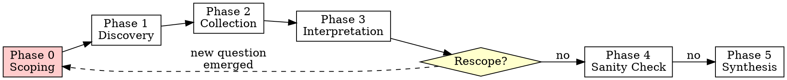

# DeFi On-Chain Analytics

> **Core Principle:** 「先固定資料可信度與上下文，再做最小足夠的讀取，之後才做歸因與敘事。」
> First fix data confidence and context, then do minimum sufficient reads, then do attribution and narrative.

Every analysis session serves this hierarchy: **confidence > efficiency > interpretation**.

## Two-Layer Architecture

Every step is tagged with its required tier:

| Tier | Tag | Requires | Free public RPC? |
|------|-----|----------|-----------------|
| A | `[CORE]` | Standard JSON-RPC | Yes |
| B | `[ARCHIVE]` | Historical state >128 blocks | Rarely |
| C | `[TRACE]` | debug/trace namespace (Geth archive or Erigon) | No |
| D | `[ENRICH]` | External source (Etherscan API, Sourcify, 4byte) | Yes but not RPC |

**Default = Tier A only.** Higher tiers are opt-in. If unavailable, disclose the gap — never silently skip.

## Looped Workflow

Real investigations evolve — discovery changes the question. The workflow supports iteration, not just linear execution.



**Why no skipping phases:** Phase 0 prevents wasted RPC calls on wrong targets or wrong chains. A single `eth_getLogs` to the wrong address can eat your entire rate limit. Lock scope first, then query.

### Scope Amendment (Re-entry)

When Phase 3 interpretation reveals a new analytical question that changes the objective, the investigation loops back to Phase 0 in amendment mode. Without strict rules, this loop degenerates into "ask again" — so the state machine below governs every re-entry.

**Valid rescope triggers:**

| Trigger | Example |
|---------|---------|
| New unit of analysis discovered | Investigating a vault → found the strategy contract is the real subject |
| Objective fundamentally changed | Started with "is this vault profitable?" → discovered potential exploit |
| Chain expansion needed | Fund flow leads to a bridge contract → need to trace on source chain |

**NOT a rescope (handle in-phase):**

| Situation | Instead |
|-----------|---------|
| Need more data on same target | Continue Phase 2 — add queries |
| Found unknown contract during analysis | Load `contract-inspection.md` via cascade trigger |
| Confidence too low on a finding | Apply Layer 5 (Confidence Deepening) — don't restart |

**Carry-forward rules:** On rescope, the following are preserved unchanged unless explicitly overridden:
- Chain, anchor policy, anchor block, capability tier, RPC endpoint
- All existing evidence register entries
- All pattern files already loaded

**Only these fields may change:** target, objective, unit of analysis, hypothesis, timeframe, additional pattern files.

**Completion criteria per mode:**

| Mode | Done when |
|------|-----------|
| 🔍 Forensic | Root cause attributed with claim type + all fund hops traced to terminus or gap disclosed |
| 📊 Due Diligence | All decision-critical metrics computed + gaps flagged |
| 📈 Monitoring | Current state snapshot complete + health indicators evaluated |
| 🏗️ Protocol Assessment | Key metrics + risk dimensions scored |
| 🛡️ Security | Admin/upgrade/custody risk assessed + findings severity-ranked |
| 🔭 Exploratory | Survey breadth covers user's question + open questions listed |

**Hard cap:** Max 3 scope amendments per session. Beyond that, synthesize what you have and list remaining questions as Open Questions in Phase 5.

---

### Phase 0: Scoping Gate — Active Consultation

> **This phase is a guided conversation, NOT a passive form.**
> Read `references/scoping-guide.md` for detailed consultation techniques, depth/angle options, field-by-field asking guidance, and anti-patterns.
> **Silently assuming scope details is the #1 cause of wasted RPC calls.** Surface your assumptions as explicit questions.

#### Analysis Modes

| Trigger | Mode | Emphasis |
|---------|------|----------|
| Suspicious activity / incident | 🔍 Forensic | Fund flows, timeline, counterparties |
| Investment / trading decision | 📊 Due Diligence | Risk, PnL, position health |
| Portfolio / position monitoring | 📈 Monitoring | Current state, health indicators |
| Protocol evaluation / comparison | 🏗️ Protocol Assessment | TVL, risk params, governance |
| Security review / audit prep | 🛡️ Security | Admin keys, upgrades, custody |
| General curiosity / learning | 🔭 Exploratory | Broad survey, teach as you go |

If the user's request clearly maps to one mode, **propose it** rather than asking from scratch.

#### Required Fields

| # | Field | Required? | Default |
|---|-------|-----------|---------|
| 1 | **Target** | Yes | — |
| 2 | **Chain** | Yes | — |
| 3 | **Objective** | Yes | — |
| 4 | **Unit of analysis** | Yes | — |
| 5 | **Hypothesis** | No | "Exploratory" |
| 6 | **Timeframe** | No | Per depth choice |
| 7 | **Expected output** | No | "Structured findings + narrative" |
| 8 | **Data source policy** | No | raw RPC only |
| 9 | **Anchor policy** | No | `safe` if supported |
| 10 | **Capability tier** | Auto | Probe-based |
| 11 | **RPC endpoint** | Auto | From `references/rpc-endpoints.ts` |

**Unit of analysis** — Declare what object is being analyzed: `wallet` / `contract` / `vault` / `pool` / `protocol` / `token`. This prevents scope drift by making the analytical focus explicit. When the unit changes mid-investigation, that's a scope amendment trigger.

#### Anchor Policy Options

| Policy | `fromBlock` | `toBlock` | Use Case |
|--------|------------|----------|----------|
| `safe` | — | `safe` tag | **Default.** Finalized, no reorg risk. |
| `pinned` | specific hex | specific hex | Reproducible snapshot at known block. |
| `latest` | — | `latest` tag | Real-time data, accepts reorg risk. |
| `historical-scan` | `0` or contract creation block | `safe` | **Full-chain event scanning.** Each event gets its own timestamp via `eth_getBlockByNumber`. Use adaptive chunking (see `references/rpc-field-guide.md` Section 5). |

#### Decision Dependencies

Some conditions — not just missing data sources — can flip the analytical conclusion entirely:

| Condition | Impact | Without Checking |
|---|---|---|
| External rewards (Merkl, Angle, etc.) | LP/vault alpha reversal | Raw alpha appears negative when net return is positive |
| Vesting schedule + unlock events | Supply shock | Circulating supply appears stable when unlocks are imminent |
| Oracle staleness + backup fallback | Protocol health misjudged | Protocol appears healthy when oracle is stale |
| Provider endpoint inconsistency | Data conflict | Two endpoints return different logs for the same range — analysis built on partial data |
| Proxy upgraded during scan window | ABI/layout mismatch | Events decoded with wrong ABI; storage reads return garbage for blocks after upgrade |
| Unresolved bridge leg | Incomplete fund flow | Funds appear to vanish at bridge contract; actual destination chain not traced |
| Token/share conversion uncertainty | Value miscalculation | Vault share counted as underlying token; 1 share ≠ 1 token |
| Partial `eth_getLogs` coverage | Silent truncation | Provider hit result cap but returned no error; event history appears complete but is missing entries |

If any decision-critical condition is unverified, flag it as: `⚠️ DECISION-CRITICAL GAP: [condition] unverified. Conclusion may reverse.`

#### Blind Spot Disclosure

Before confirming, proactively flag what the analysis CANNOT see. See `references/scoping-guide.md` for templates.

#### Confirmation Gate

Present a structured summary before proceeding. Skipping confirmation risks running hundreds of calls only to discover you answered the wrong question.

```
═══ ANALYSIS PLAN ═══
🎯 Target: [address/protocol/token]
🔗 Chain: [chain]
📋 Objective: [clear restatement]
🔬 Unit: [wallet/contract/vault/pool/protocol/token]
🧪 Hypothesis: [if any, or "Exploratory"]
⏱️ Timeframe: [window]
📊 Output: [format]
⚡ Data policy: [Tier A / A+D / etc.]
⚓ Anchor: [safe / pinned / latest / historical-scan]
⚠️ Blind spots: [key limitations]
⚠️ Decision gaps: [decision-critical sources unavailable, if any]
Estimated effort: ~[N] RPC calls
═════════════════════
```

```
═══ ANALYTICAL CONTRACT ═══
⚙ Tier A baseline: [list the specific RPC calls that must be made before any Tier D source is used]
📜 Script trigger: [YES if any dependent flow / eth_getLogs scan / multi-hop trace is needed]
🔍 Root cause standard: Any causal claim sourced from Tier D only → tagged [UNVERIFIED] until Tier A/B corroboration
🧪 Claim typing: All major findings typed as FACT_ONCHAIN / INFERENCE_ONCHAIN / EXTERNAL_ASSERTION before Phase 4
═══════════════════════════
```

See `references/scoping-guide.md` for a filled-in example of the Analytical Contract.

**Gate rules:**
- User confirms BOTH the Analysis Plan AND the Analytical Contract before Phase 1 begins. If user says "just do it" → present the plan, then proceed.
- Auto-probe capability tier (Field 10) via test calls. Timeout/failure = assume Tier A.
- Auto-select RPC endpoint (Field 11): read `references/rpc-endpoints.ts` → pick top Tier S/1 → probe with `eth_chainId` → fallback on failure. For BSC, use endpoint with `getLogs: true` (Tier 1/2 only).
- **Cross-chain check:** If target involves bridges or multi-chain activity, flag and expand scope.
- Load relevant pattern file(s) based on objective (see Pattern Loading below).

---

### Phase 1: Discovery

**RPC-first. External metadata is enrichment, not baseline.** The reason: Tier D labels drift and degrade over time. If you build conclusions on Tier D first, you have no way to detect when the label becomes wrong. Tier A data is immutable on-chain.

**Step 1 — Contract Classification `[CORE]`:**
1. `eth_getCode(address)` — EOA (empty) or contract?
2. If contract: `eth_getStorageAt` for EIP-1967 slots (implementation, beacon, admin)
3. Bytecode pattern match for EIP-1167 minimal clone
4. If proxy detected → read implementation → repeat on implementation

**Step 2 — Interface Recovery `[CORE]` (mandatory for contracts):**

> When `eth_getCode` returns non-empty and EIP-1967 slots are non-zero, read `references/abi-fetching.md` for the full proxy resolution and selector extraction procedures.

If target is a proxy:
1. Resolve implementation address (EIP-1967 → beacon → bytecode → trace)
2. Attempt ABI recovery: Etherscan → Sourcify → 4byte → bytecode extraction
3. **If no ABI found:** Extract selectors from implementation bytecode, probe each via `eth_call` to classify return types. See `references/proxy-resolver-scaffold.ts` for a ready-to-use script.
4. **Function selectors vary across implementations of the same protocol.** `getTotalAmounts()` (0xd4789053) may not exist — the equivalent function could have a different name and selector (e.g., 0xc4a7761e). Always verify by probing the actual implementation. Never assume from documentation.

This step is not optional. For any contract beyond a standard ERC-20, interface discovery typically determines whether the investigation succeeds or fails. Skipping it means every subsequent `eth_call` is a guess.

**Watch for same-address multiple roles:** Some DeFi systems use a single contract as vault + share token + strategy router simultaneously. If the target serves multiple roles, document all interfaces discovered — don't stop at the first successful ABI match.

**Step 3 — Address Context `[CORE]`:**
- `eth_getBalance`, `eth_getTransactionCount`, `eth_getStorageAt` for owner/admin slots
- Lineage (deployer, creation tx): `[ENRICH]` — mark `N/A` in strict RPC mode

**Step 4 — Source Bootstrap `[ENRICH]` (opt-in):**
- Etherscan `getsourcecode`, Sourcify, 4byte.directory
- Entity labels → heuristic, confidence auto-downgraded

**Tier D Precondition:** Before using any Tier D source for a given finding, the equivalent Tier A query must already exist in the evidence register. Tier D enriches; it never substitutes. The reason: if the Tier D source is wrong or stale, you need the Tier A data to detect the discrepancy.

**Output: Reconnaissance summary table.** Every field tagged with source tier. Unavailable fields marked `N/A (requires Tier X)`.

---

### Phase 2: Data Collection

**Rule: Block-anchor everything. Probe before assuming. Disclose gaps.**

Read `references/rpc-field-guide.md` when choosing RPC methods or when `eth_getLogs` returns an error code. Load ABI references by objective: `references/abis-core-tokens-vaults.md` (tokens/vaults), `references/abis-dex-v3-v4-clamm.md` (Uniswap/Algebra CLAMM), and `references/abis-proxy-and-multicall.md` (proxy slots/Multicall3).

**Tier 1 — Batch Reads `[CORE]`:**
- Multicall3 or JSON-RPC batch, pinned to single block number
- Use for: balances, vault positions, pool reserves, oracle prices

**Tier 2 — Event Logs `[CORE]`:**
- Unbounded block ranges trigger provider-side timeouts or 10K result caps, silently truncating your event history. Always bound ranges.
- Adaptive chunking: probe provider limit, bisect on cap, paginate. See `references/rpc-field-guide.md` Section 5 for the algorithm and TypeScript template.
- Filter: `address + topics[0]` when possible; adapt for anonymous/factory scans

**Tier 3 — Traces `[TRACE]` (opportunistic):**
- `callTracer(withLog:true)` — internal calls + logs per frame
- `prestateTracer(diffMode:true)` — pre/post state diff
- `trace_filter` (Erigon) — address-range internal tx search
- **Iron rule:** If native ETH flow + Tier C available → traces mandatory. If unavailable → disclose: _"Native ETH internal transfers not captured. Fund flow covers ERC20 only."_

**Tier 4 — State Override `[TRACE]`:**
- `eth_call` with `stateOverride` / `blockOverride` for hypothesis testing
- Use `stateDiff` (merge) not `state` (wipe) unless intended. Accidental use of `state` zeros out all unlisted slots, producing garbage results.

**Tier 5 — Specialized (probe first):**
- `eth_getProof` `[CORE]`, `eth_getBlockReceipts` `[varies]`, `eth_createAccessList` `[CORE]`

**Script generation decision:**

| Condition | Mode |
|-----------|------|
| Independent trivial reads (balance, nonce, single slot) | Inline `curl` |
| Any dependent / sequential calls | Generate TS script (viem) |
| Any `eth_getLogs` scan (any range) | Generate script |
| Multicall3 batch | Generate script |
| Multi-hop fund flow tracing | Generate script |

Scripts must be self-contained, use viem, and runnable via `bun run script.ts`. Do not create `package.json` or install packages locally — bun auto-resolves npm imports from its global cache, leaving no artifacts in the working directory.

**For bulk data collection (>100 RPC calls):** Read `references/data-collection-scaffold.ts` — covers rate limiting, endpoint rotation, checkpoint/resume, and CSV output. This saves reinventing these patterns from scratch each time.

**Scaffold:** For incident forensics, start from `references/forensic-script-scaffold.ts`.

**Execution discipline:**
- Log purpose before every query
- Decode all hex inline — raw hex in output means the analysis is unreadable to the user
- Use fallback endpoints on failure
- Disclose when methods are skipped due to tier

**Practical failure modes to watch for:**
- **Silent `eth_getLogs` truncation:** Provider hit result cap but returned no error — event history appears complete but has gaps. Cross-check total event count against a second endpoint or block explorer if feasible.
- **Endpoint disagreement:** Two providers return different log counts for the same range. This typically means one hit an undocumented limit. Always note which endpoint was used per query.
- **L2 timestamp mismatch:** On OP Stack and Arbitrum, `block.timestamp` semantics differ from L1. Sorting by timestamp across chains without normalization produces incorrect chronology.
- **Scan window crosses proxy upgrade:** If the target contract was upgraded during your `fromBlock→toBlock` range, events before and after the upgrade may have different ABIs. Check `Upgraded` events on the proxy before scanning.

---

### Phase 3: Interpretation

Read the relevant domain pattern file for analytical methods. Apply the Investigation Discipline protocol throughout this phase (see below and `references/investigation-discipline.md`).

**Claim typing — mandatory for every major finding:** `FACT_ONCHAIN` (proven by Tier A/B artifact) / `INFERENCE_ONCHAIN` (derived from Tier A/B) / `EXTERNAL_ASSERTION` (from Tier D — tag `[UNVERIFIED]` if used as root cause without Tier A/B corroboration). See Phase 3 Exit Gate in `references/investigation-discipline.md`.

**Classification-first.** Tag every finding before narrative:

| Category | Source | Confidence | Min Tier |
|----------|--------|-----------|----------|
| **State-based** | Storage, balances, rates | Highest | A |
| **Flow-based (events)** | Transfer/Swap events | High | A |
| **Flow-based (traces)** | Internal calls, native ETH | High | C |
| **Label-based** | Entity attribution | Medium (degrades) | D |
| **Inferred** | Patterns, correlation | Lowest | varies |

**Time-alignment:** `block number → tx index → log index → traceAddress`

**Mental models (in order):**
1. **Attribution hierarchy** — state > flow > label > inference
2. **Follow the money** — traces if Tier C; events if Tier A (disclose native ETH gap)
3. **Behavioral pattern matching** — against domain reference patterns
4. **MEV noise awareness** — same-block buy+sell, tx index adjacency, known builders → flag
5. **Entity clustering** — shared funding, synchronized timing → "wallet" upgrades to "entity"
6. **Anomaly flagging** — rolling baseline if available; rule-based flags if no stable baseline

**Tokenomics mandatory check:**

| Property | Impact | Detection |
|----------|--------|-----------|
| Rebasing | Balance changes without Transfer events | balanceOf delta without Transfer |
| Fee-on-transfer | Sent ≠ received | Transfer amount vs balanceOf delta |
| ERC-4626 shares | Share ≠ underlying | Read `convertToAssets()` |
| Wrapped staking | Conversion rate drifts | Read wrapper rate function |

**Scope amendment trigger:** If interpretation reveals a new analytical question that changes the original objective, re-enter Phase 0 in amendment mode (see Scope Amendment above).

---

### Phase 4: Sanity Check

**Always-on checks:**
- [ ] All reads anchored to same block / finality level?
- [ ] Internal txs accounted for (traces if ETH flow + Tier C)?
- [ ] Gaps disclosed if traces unavailable?
- [ ] Proxy vs implementation resolved?
- [ ] Labels cross-referenced, not blindly trusted?
- [ ] Off-chain blind spots acknowledged? (CEX internal, L2, OTC)
- [ ] Every finding tagged with tier dependency?
- [ ] **Phase 3 Exit Gate passed?** (claim typing, Dismissal Log, counter-hypotheses — see `references/investigation-discipline.md`)
- [ ] **Blind Spot Audit completed?** (Layer 4 — see `references/investigation-discipline.md`)
- [ ] **Gap Log produced?** (Layer 7 — every skipped method/source logged with reason and impact)
- [ ] **Confidence-triggered deepening applied?** (Layer 5 — no Medium-confidence significant findings left unaddressed)

**Domain-specific pitfall packs** — load based on Phase 0 objective. Full checklists in each pattern file.

---

### Phase 5: Synthesis

Output profile determined by Phase 0 analysis mode. The reproducibility footer is always required — without it, nobody can verify or reproduce your findings.

| Mode | Profile | Required Sections |
|---|---|---|
| 🔍 Forensic | Full Evidence Grade | All 7: Findings, Narrative, Confidence Matrix, Visualization, Open Questions, Reproducibility Footer, Evidence Register |
| 📊 Due Diligence | Performance Analysis | Findings + Benchmarks + Confidence Matrix + Open Questions + Reproducibility Footer |
| 📈 Monitoring | Snapshot | Current State + Health Indicators + Alerts + Reproducibility Footer |
| 🏗️ Protocol Assessment | Diligence Memo | Executive Summary + Key Metrics + Risk Factors + Reproducibility Footer |
| 🛡️ Security | Security Report | Findings + Severity + Recommendations + Evidence Register + Reproducibility Footer |
| 🔭 Exploratory | Survey | Findings + Narrative + Open Questions + Reproducibility Footer |

**Reproducibility footer format:**
```
Chain / Anchor block / Anchor policy / RPC provider
Capability tier / Trace-enabled / Archive / External sources
Total RPC calls / Analysis timestamp
```

**Evidence register** (required for 🔍 Forensic and 🛡️ Security, recommended for others):
Per finding: claim type (`FACT_ONCHAIN` / `INFERENCE_ONCHAIN` / `EXTERNAL_ASSERTION`), RPC method, params, block ref, cross-validation.

---

## Pattern File Loading

| Objective keywords | Load |
|-------------------|------|
| wallet, address, PnL, whale, smart money, entity | `patterns/wallet-analytics.md` |
| TVL, protocol, risk, yield, pool, lending | `patterns/protocol-analytics.md` |
| token, holder, distribution, supply, vesting | `patterns/token-analytics.md` |
| DEX, swap, liquidity, LP, impermanent loss, volume | `patterns/dex-analytics.md` |
| vault, CLAMM, concentrated liquidity, share price, rebalance, LP performance | `patterns/clamm-vault-analytics.md` |
| contract, storage, events, proxy, upgrade, ABI | `patterns/contract-inspection.md` |

Multiple files may load if objective spans domains. Reference files (`references/`) loaded on-demand during Phase 1-2. For incident forensics, `references/forensic-script-scaffold.ts` is the canonical starting script.

### Cascade Triggers

During Phase 2-3, load additional patterns when the investigation reveals new dimensions:

| Trigger (during analysis) | Load |
|--------------------------|------|
| Entities or wallets identified that need profiling | `patterns/wallet-analytics.md` |
| Unknown contract requiring ABI resolution | `patterns/contract-inspection.md` |
| Token supply or holder distribution analysis needed | `patterns/token-analytics.md` |
| Protocol-level risk or TVL assessment triggered | `patterns/protocol-analytics.md` |
| DEX swap or LP position analysis required | `patterns/dex-analytics.md` |
| Vault rebalance, share-price, or concentrated IL analysis | `patterns/clamm-vault-analytics.md` |

## Investigation Discipline — 7-Layer Defense

Read `references/investigation-discipline.md` for full methodology, DeFi-specific anti-rationalization phrases, iterative depth protocol, and adversarial self-review questions.

| # | Layer | Rule | Active |
|---|-------|------|--------|
| 1 | **Anti-Rationalization** | Dismissal instincts are investigation signals. Wanting to say "probably normal" → investigate that exact thing deeper. | Always |
| 2 | **Iterative Depth** | Phase 3 runs multiple passes. Pass 2 (Forensic/Deep History): adversarial re-examination — "if this were malicious, what would the evidence look like?" | 🔍🔴 |
| 3 | **Anti-Normalization** | "Looks normal" is evidence of sophistication, not innocence. Adversarial actors design on-chain footprints to appear normal. "Too clean" = red flag. | Always |
| 4 | **Blind Spot Audit** | Phase 4 must list what was NOT investigated and what each gap could hide. Empty blind spot audit = failed Phase 4. | Always |
| 5 | **Confidence Deepening** | Confidence < High + significance ≥ Medium → additional query, cross-validation, OR explicit UNRESOLVED. No "Medium confidence, probably fine." | Always |
| 6 | **Adversarial Self-Review** | Per major finding: "What is the opposite interpretation?" + "What adjacent pattern does this obscure?" + "What would falsify this?" + "Does any other finding enable this?" | Always (documented in 🔍) |
| 7 | **Gap Logging** | Every skipped method/source logged with reason and potential impact. Silent omission = discipline violation. | Always |

### Banned Dismissal Phrases & Common Rationalizations

See `references/investigation-discipline.md` for the full list. The core rule: if you catch yourself wanting to dismiss a finding as "probably normal," that's an investigation signal, not a conclusion. Skipping Phase 0 "just for a quick check" is how wrong-chain queries happen.

## Red Flags — STOP

These five signals indicate you're violating the workflow's core purpose. If any appear, stop and correct course:

- Making RPC calls before completing Phase 0 — you're guessing, not analyzing
- Using `"latest"` without explicitly choosing it — you're accepting reorg risk unconsciously
- Leaving raw hex values in output — your analysis is unreadable
- Querying `eth_getLogs` without bounded block range — you're risking silent truncation
- Dismissing a finding without asking "What would make this significant?" — you're rationalizing, not investigating
